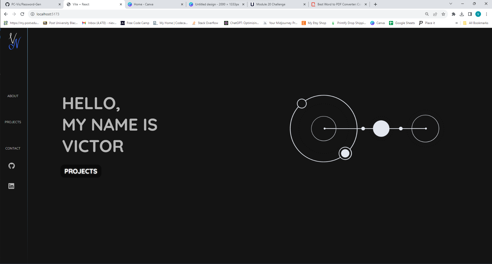
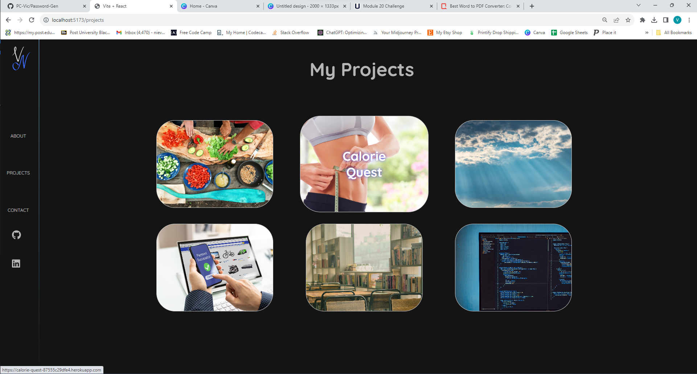
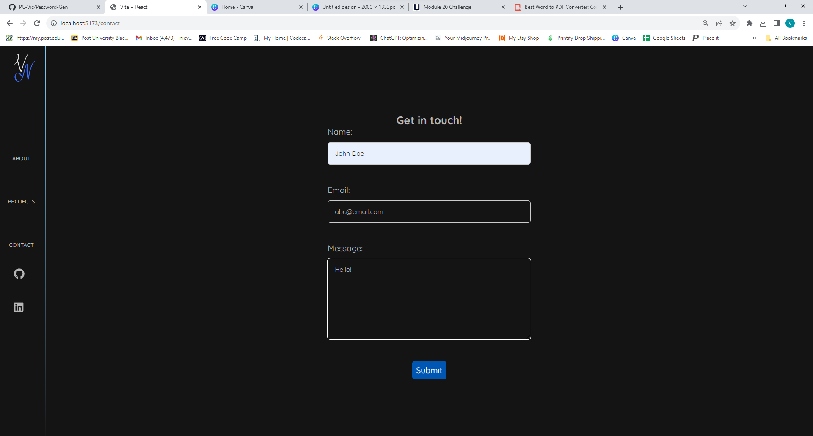

# Victor Nieves Dev Site

Welcome to my Full Stack Engineer portfolio! This project is built using React and features stylish CSS animations.

## Table of Contents

- [Victor Nieves Dev Site](#victor-nieves-dev-site)
  - [Table of Contents](#table-of-contents)
  - [Sections](#sections)
    - [1. Homepage](#1-homepage)
    - [2. About](#2-about)
    - [3. Projects](#3-projects)
    - [4. Contact](#4-contact)
      - [Screenshots](#screenshots)
    - [5. Contact](#5-contact)
  - [Link to app and GitHub](#link-to-app-and-github)

## Sections

### 1. Homepage

- The homepage provides an overview of the portfolio and serves as the starting point for visitors.

### 2. About

- The About section contains information about me, including my background, skills, and any other relevant details.

### 3. Projects

- The Projects section showcases various coding projects that I have worked on. Each project card includes a link to the project site.

### 4. Contact

- The Contact section allows visitors to get in touch with me by filling out a form.

#### Screenshots

Here are some screenshots of Calorie Quest in action:

*Homepage*

*Profile page*

*Contact Page*

### 5. Contact

If you have any questions, suggestions, or feedback regarding the Coding Quiz Challenge!, please feel free to contact me:

- Email: victordev@vicnieves.com
- GitHub: PC-Vic https://github.com/PC-Vic/JavaScript-Quiz-app

## Link to app and GitHub
https://pc-vic.github.io/Victor-Nieves-Dev-Site

https://github.com/PC-Vic/Victor-Nieves-Dev-Site 
